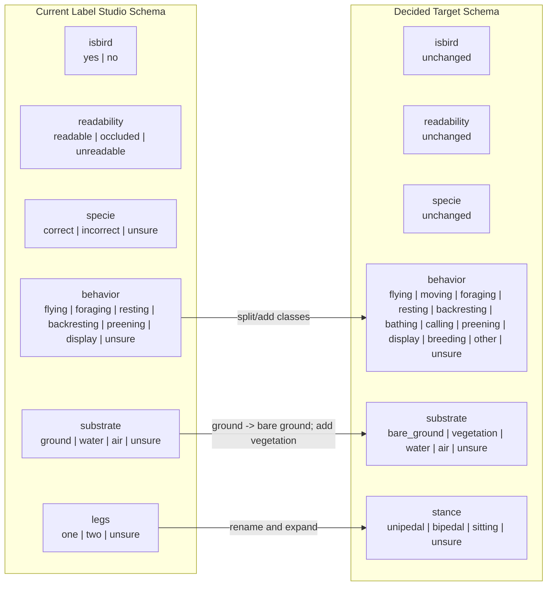
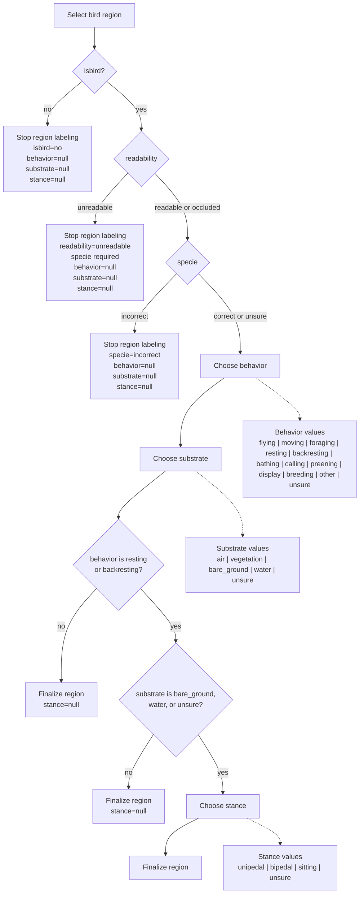

# Annotation Schema: Current vs `updates.md`

This document compiles the free-form change requests in [updates.md](/Users/antoine/truenas_migration/bird_stance_classification/updates.md) against the actual current Label Studio schema in [projects/labelstudio/label_config.xml](/Users/antoine/truenas_migration/bird_stance_classification/projects/labelstudio/label_config.xml).

Important:
- "Current schema" below means the live-style Label Studio config in `projects/labelstudio/label_config.xml`.
- It does **not** mean the broader future-state spec in [SPECIFICATION_v2.md](/Users/antoine/truenas_migration/bird_stance_classification/SPECIFICATION_v2.md).
- There is already one drift today: `SPECIFICATION_v2.md` mentions `legs=sitting`, but the current Label Studio config does not expose that choice.

## Current Schema

### Per-bird core
- `isbird`: `yes`, `no`
- `readability`: `readable`, `occluded`, `unreadable`
- `specie`: `correct`, `incorrect`, `unsure`

### Per-bird context
- `behavior`: `flying`, `foraging`, `resting`, `backresting`, `preening`, `display`, `unsure`
- `substrate`: `ground`, `water`, `air`, `unsure`

### Conditional stance field
Field name in the current config:
- `legs`

Shown only when:
- `behavior in {resting, backresting}`
- and `substrate in {ground, water, unsure}`

Choices:
- `one`
- `two`
- `unsure`

## Requested Updates Compiled From `updates.md`

### Explicitly requested additions
- Add `sitting` in the stance category.
- Split current `foraging` into:
- `moving`
- `foraging`
- Add behavior:
- `bathing`
- `calling`
- Add optional catch-all:
- `other`

### Explicitly requested target vocabulary
The final message in `updates.md` proposes:
- `Behavior -> bathing, calling, moving, foraging, resting, backresting, preening, breeding, unsure`
- `Stance -> unipedal, bipedal, sitting, unsure`
- `Substrate -> air, vegetation, bare ground, water, unsure`

## Decisions Applied

The following decisions are now assumed for planning:

- `breeding` is a new behavior class
- `flying` stays
- `other` is included in `behavior`
- UI field `legs` becomes `stance`
- `ground` becomes `bare_ground`

That means the migration target is no longer ambiguous for planning purposes.

## Side-By-Side Comparison

| Field | Current schema | Requested update | Change type | Compatibility note |
| --- | --- | --- | --- | --- |
| `isbird` | `yes`, `no` | unchanged | none | no migration needed |
| `readability` | `readable`, `occluded`, `unreadable` | unchanged | none | no migration needed |
| `specie` | `correct`, `incorrect`, `unsure` | unchanged | none | no migration needed |
| `behavior` | `flying`, `foraging`, `resting`, `backresting`, `preening`, `display`, `unsure` | `flying`, `moving`, `foraging`, `resting`, `backresting`, `bathing`, `calling`, `preening`, `display`, `breeding`, `other`, `unsure` | expansion | keep old labels valid; add new labels without dropping old ones |
| `substrate` | `ground`, `water`, `air`, `unsure` | `bare_ground`, `vegetation`, `water`, `air`, `unsure` | rename plus expansion | map `ground -> bare_ground`; add `vegetation` |
| `legs` / `stance` | `one`, `two`, `unsure` | `unipedal`, `bipedal`, `sitting`, `unsure` | semantic rename plus expansion | map `one -> unipedal`, `two -> bipedal`; add `sitting` |

## Visual Diff

## Full Decision Flow

## Recommended Migration Target

This is the cleanest update path if you want backward-compatible training.

### UI schema target
- Keep:
- `isbird`, `readability`, `specie`
- Replace:
- `legs` with `stance`
- Expand:
- `behavior`
- `substrate`

### Recommended target labels

Behavior:
- `flying`
- `moving`
- `foraging`
- `resting`
- `backresting`
- `bathing`
- `calling`
- `preening`
- `display`
- `breeding`
- `other`
- `unsure`

Substrate:
- `bare_ground`
- `vegetation`
- `water`
- `air`
- `unsure`

Stance:
- `unipedal`
- `bipedal`
- `sitting`
- `unsure`

### Backward-compatibility mapping

Old export -> new canonical normalized value:
- `behavior=foraging` stays `foraging`
- no old equivalent for `moving`, `bathing`, `calling`, `other`, `vegetation`
- no old equivalent for `breeding`
- `behavior=display` stays `display`
- `substrate=ground` -> `substrate=bare_ground`
- `legs=one` -> `stance=unipedal`
- `legs=two` -> `stance=bipedal`
- `legs=unsure` -> `stance=unsure`

### Storage recommendation

During migration, keep normalized output backward-compatible by:
- preserving old columns for training code that already exists
- adding new canonical columns or alias logic in normalization

Minimum safe path:
- keep normalized `behavior` column, but allow more labels
- keep normalized `substrate` column, with `ground` aliased to `bare_ground`
- keep normalized `legs` column temporarily, but normalize UI `stance` into it with:
- `unipedal -> one`
- `bipedal -> two`
- `sitting -> sitting`
- `unsure -> unsure`

Cleaner long-term path:
- replace normalized `legs` with `stance`
- add compatibility view or adapter for old training code

## Recommended Next Repo Changes

1. Freeze the intended updated taxonomy in a single authoritative file.
2. Update `projects/labelstudio/label_config.xml` to the decided target taxonomy.
3. Update `projects/datasets/src/birdsys/datasets/export_normalize.py` to accept both old and new label aliases.
4. Add tests for:
- old export -> old normalization
- new export -> new normalization
- old export -> compatibility-normalized output
5. Update training label maps only after the final class list is frozen.
