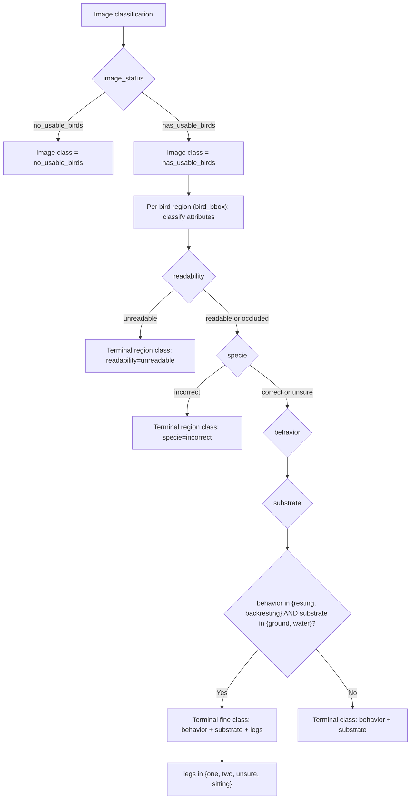

# `label_config_b1_strict_nested.xml` Classification Graph

## Interpretation

- The image has a top-level class: `image_status`.
- Region taxonomy is only meaningful when `image_status=has_usable_birds`.
- Region classification has two early-stop terminal classes:
  - `readability=unreadable`
  - `specie=incorrect`
- Otherwise, the region class is defined by:
  - `behavior` + `substrate`
  - plus `legs` only in the resting/backresting on ground/water subspace.
